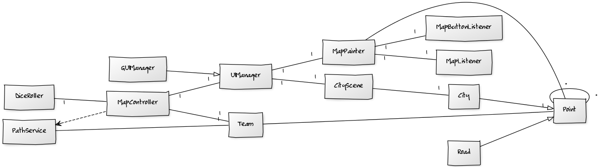

#Skynail
**Aihe**: Vuoropohjainen roolipeli

Toteutetaan vuoropohjainen roolipeli, jonka rakenne on sekoitus perinteistä lautapeliä ja tietokoneroolipeliä. Pelissä liikutaan lautapelimäisellä kartalla kohteiden välillä, joissa pelaaja taistelee hirviöiden kanssa ja kerää aarteita, esineitä ja liittolaisia. Pelin tavoite on löytää Naulatähti, taivaankannesta maahan pudonnut taikaesine.

Pelissä on toteutuksen alkuvaiheessa yksi pelaaja. Kehityksen edetessä tarkoitus on toteuttaa peliin tietokoneen ohjaamia vastustajia, jotka liikkuvat kartalla ja kilpailevat pelaajan kanssa resursseista.

**Suunnitteluvaiheen luokkakaavio**

Luokkakaavio kuvaa ohjelman rakennetta viikolla 4. Graafisen käyttöliittymän rakennetta on muutettu selkeämmäksi ja hierarkisemmaksi lisäämällä rajapinta UIManager, jonka aliluokka GUIManager hoitaa graafisen käyttöliittymän toiminnan. CityScene on uusi käyttöliittymäelementti joka hoitaa tapahtumat kaupungissa. 

**Kartta**

Kartalla liikkuminen muistuttaa perinteisiä lautapelejä, erityisesti Afrikan tähteä. Joka vuorolla pelaaja heittää kahta noppaa ja siirtyy enintään noppaluvun määräämän lukumäärän. Pelilauta ei koostu ruuduista vaan solmuista, jotka muodostavat verkon; solmu yhdistyy siis aina yhteen tai useampaan solmuun. 

Kartta toteutetaan alkuvaiheessa tekstipohjaisena. Kehityksen edetessä kartta on kuitenkin tarkoitus toteuttaa graafisena niin, että pelaaja voi valita hiirellä solmun, johon siirtyy.

Solmuista osa on erityisiä kohteita, joihin pelaaja voi jäädä. Tästä seuraa erityinen tapahtuma sen mukaan, mitä ominaisuuksia kohteella on. Kohdetyyppejä ovat esimerkiksi:

* Luolasto
	* Luolastossa on yksi tai useampi hirviö, joiden kanssa voi taistella. Jos pelaaja voittaa, pelaaja saa luolastossa sijaitsevan aarteen.
* Kaupunki
	* Kaupungeissa voi ostaa tavaroita.

**Taistelu**

Taistelut tapahtuvat omassa erillisessä ruudussaan. Taistelut ovat vuoropohjaisia ja pelaaja valitsee jokaiselle pelaajahahmolle komennon yksitellen. Tarkempi toteutus määritellään myöhemmin.

**Käyttäjät:** Pelaaja

**Pelaajan toiminnot**

* Pelaa vuoro
	* pelaaja heittää noppia ja siirtyy kartalla noppaluvun verran.
* Tee ostoksia kaupungissa
