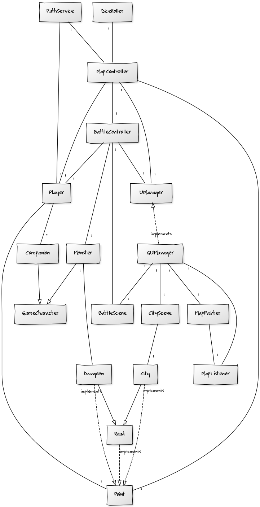

#Skynail
**Aihe**: Vuoropohjainen roolipeli

Toteutetaan vuoropohjainen roolipeli, jonka rakenne on sekoitus perinteistä lautapeliä ja tietokoneroolipeliä. Pelissä liikutaan lautapelimäisellä kartalla kohteiden välillä, joissa pelaaja taistelee hirviöiden kanssa ja kerää aarteita, esineitä ja liittolaisia. Pelin tavoite on löytää Naulatähti, taivaankannesta maahan pudonnut taikaesine.

Pelissä on toteutuksen alkuvaiheessa yksi pelaaja. Kehityksen edetessä tarkoitus on toteuttaa peliin tietokoneen ohjaamia vastustajia, jotka liikkuvat kartalla ja kilpailevat pelaajan kanssa resursseista.

**Suunnitteluvaiheen luokkakaavio**

Luokkakaavio kuvaa ohjelman rakennetta viikolla 5. Karttasolmuluokat perivät nyt Road-luokan ominaisuudet sen lisäksi, että ne toteuttavat Point-rajapinnan, mikä vähentää päällekkäistä ohjelmakoodia. Käyttöliittymää on edelleen pyritty eriytettämään pelilogiikasta. 

Ohjelmaan on uutena ominaisuutena tullut taistelukohtauksissa BattleController ja sen käyttöliittymä BattleScene. Entinen Team-luokka, nykyinen Player, sisältää nyt pelaajahahmoja, ja luolastot (Dungeon) sisältävät hirviöitä, jotka molemmat periytyvät geneerisestä GameCharacter-luokasta. GameCharacter sisältää taistelukohtauksissa käytettyä alkeellista peruslogiikkaa, jota alaluokat vaativat.

###Kartta

Kartalla liikkuminen muistuttaa perinteisiä lautapelejä, erityisesti Afrikan tähteä. Joka vuorolla pelaaja heittää noppaa ja siirtyy enintään noppaluvun määräämän lukumäärän. Pelilauta ei koostu ruuduista vaan solmuista, jotka muodostavat verkon; solmu yhdistyy siis aina yhteen tai useampaan solmuun. 

Kartta toteutettiin alkuvaiheessa tekstipohjaisena ja tämän jälkeen graafisesti niin, että kartta näytetään verkostona. Graafisessa käyttöliittymässä pelaaja voi heittää noppaa, minkä jälkeen käyttöliittymä näyttää lailliset siirrot, joiden joukosta pelaaja voi valita hiirellä solmun, johon siirtyy. 

Solmuista osa on erityisiä kohteita, joihin pelaaja voi jäädä. Tästä seuraa erityinen tapahtuma sen mukaan, mitä ominaisuuksia kohteella on. Kohdetyyppejä ovat esimerkiksi:

* Luolasto
	* Luolastossa on yksi tai useampi hirviö, joiden kanssa voi taistella. Jos pelaaja voittaa, pelaaja saa luolastossa sijaitsevan aarteen.
* Kaupunki
	* Kaupungeissa voi ostaa tavaroita.

**Sekvenssikaaviot**

*Nopanheitto:*

*Liikkuminen kartalla:*

Kaavio kuvaa käyttöliittymän päällekkäisyyttä: kun pelaaja saapuu kaupunkiin tai luolastoon, luodaan uusi käyttöliittymä. Tämän aikaa mapController ja sen käyttöliittymäluokat mapPainter ja mapListener säilyvät taustalla, ja niihin palataan kun taistelu tai kaupunkikäynti päättyvät.

###Taistelu

Taistelut tapahtuvat omassa erillisessä ruudussaan. Pelaajalla voi olla useita hahmoja, jotka osallistuvat taisteluun. Taistelut ovat vuoropohjaisia ja pelaaja valitsee jokaiselle pelaajahahmolle komennon yksitellen. Tällä hetkellä hirviöitä on jokaisessa taistelussa ainoastaan yksi, pelin kehittyessä myös hirviöitä voi olla useita.

**Käyttäjät:** Pelaaja

**Pelaajan toiminnot**

* Heitä noppaa
* Siirry kartalla
	* pelaaja voi siirtyä kartalla noppaluvun verran.
* Tee ostoksia kaupungissa
* Hyökkää hirviön kimppuun
