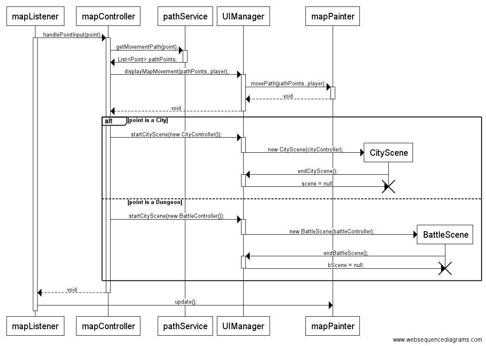

#Skynail
**Aihe**: Vuoropohjainen roolipeli

Toteutetaan vuoropohjainen roolipeli, jonka rakenne on sekoitus perinteistä lautapeliä ja tietokoneroolipeliä. Pelissä liikutaan lautapelimäisellä kartalla kohteiden välillä, joissa pelaaja taistelee hirviöiden kanssa ja kerää aarteita, esineitä ja liittolaisia. Pelin tavoite on löytää Naulatähti, taivaankannesta maahan pudonnut taikaesine.

Pelissä on pelaajan lisäksi kilpaileva tietokoneen ohjaama vastustaja, joka pelaajan tavoin pystyy keräämään aarteita luolastoista ja pyrkii löytämään Naulatähden.

**Luokkakaavio**

Luokkakaaviot kuvaavat ohjelman rakennetta lopullisen palautuksen aikaan viikolla 7, jossa uusina ominaisuuksina ovat erilliseen luokkaan asetetut palkinnot, voittoehtojen hallinta ja tietokoneen ohjaama kilpaileva pelaaja. Kartan pelilogiikka on nyt jaettu MapLogic- ja MapController-luokkien välille. Pelilogiikan monimutkaisuuden vuoksi olen jakanut luokkakaavion kolmeen osaan, joista kukin kuvastaa yhtä pelin osa-aluetta: karttaa, taistelukohtauksia ja kaupunkikohtauksia.

Karttanäkymä on pelin päänäkymä, josta muut ikkunat avataan. Kartta koostuu erilaisista toisiinsa linkitetyistä pisteistä, jotka toteuttavat Point-rajapinnan. Koko pelin tilaa käsittelevä logiikka on sijoitettu MapLogic -luokkaan, johon ihmispelaajan toimintoja toteuttava MapController ja tietokonevastustajaa hallitseva AIMover ovat yhteydessä.

MapController ja AIMover käyttävät molemmat PathService -palveluluokkaa, joka laskee mahdolliset siirrot pelaajille. Näkymällä on graafinen käyttöliittymä, joka on yhteydessä MapControlleriin UIManager-rajapinnan kautta.

Kaupunkikohtaukset alkavat pelaajan saavuttua City-tyyppiseen karttapisteeseen, jolloin MapController luo uuden CityController-olion. Kaupunkinäkymillä on oma graafinen käyttöliittymäluokkansa CityScene. Kaupungeissa on toiminnallisuus esineiden ostamiselle, jota varten on erillinen esine-luokka.

Taistelukohtaukset alkavat pelaajan saavuttua Dungeon-tyyppiseen karttapisteeseen, jolloin MapController luo uuden BattleController-olion. Taistelunäkymällä on oma graafinen käyttöliittymäluokkansa BattleScene. BattleController käyttää Dungeon-luokasta otettua listaa hirviöistä sekä pelaajan Companion- ja Item-luokista koostuvia listoja. Monster ja Companion ovat perivät ydintoiminnallisuutensa GameCharacter-luokalta.

**Sekvenssikaaviot**

*Nopanheitto:*

*Liikkuminen kartalla:*

Kaavio kuvaa käyttöliittymän päällekkäisyyttä: kun pelaaja saapuu kaupunkiin tai luolastoon, luodaan uusi käyttöliittymä. Tämän aikaa mapController ja sen käyttöliittymäluokat mapPainter ja mapListener säilyvät taustalla, ja niihin palataan kun taistelu tai kaupunkikäynti päättyvät.

###Kartta

Kartalla liikkuminen muistuttaa perinteisiä lautapelejä, erityisesti Afrikan tähteä. Joka vuorolla pelaaja heittää noppaa ja siirtyy enintään noppaluvun määräämän lukumäärän. Pelilauta ei koostu ruuduista vaan solmuista, jotka muodostavat verkon; solmu yhdistyy siis aina yhteen tai useampaan solmuun. 

Kartta toteutettiin alkuvaiheessa tekstipohjaisena ja tämän jälkeen graafisesti niin, että kartta näytetään verkostona. Graafisessa käyttöliittymässä pelaaja voi heittää noppaa, minkä jälkeen käyttöliittymä näyttää lailliset siirrot, joiden joukosta pelaaja voi valita hiirellä solmun, johon siirtyy. 

Solmuista osa on erityisiä kohteita, joihin pelaaja voi jäädä. Tästä seuraa erityinen tapahtuma sen mukaan, mitä ominaisuuksia kohteella on. Kohdetyyppejä ovat esimerkiksi:

* Luolasto
	* Luolastossa on yksi tai useampi hirviö, joiden kanssa voi taistella. Jos pelaaja voittaa, pelaaja saa luolastossa sijaitsevan aarteen, joita on kulta, esineet, uudet liittolaiset sekä pelin voittamiseen tarvittu Naulatähti.
* Kaupunki
	* Kaupungeissa voi ostaa tavaroita kullalla.

###Taistelu

Taistelut tapahtuvat omassa erillisessä ruudussaan. Pelaajalla voi olla useita hahmoja, jotka osallistuvat taisteluun. Taistelut ovat vuoropohjaisia ja pelaaja valitsee jokaiselle pelaajahahmolle komennon yksitellen. Hirviöitä on useita, ja pelaaja voi valita mitä hirviötä kukin hahmo lyö. Pelaaja voi käyttää kertakäyttöisiä esineitä taistelussa.

Kun Naulatähti on löytynyt, pelaajat voivat taistella keskenään päädyttyään samaan ruutuun.

**Käyttäjät:** Pelaaja

**Pelaajan toiminnot**

* Heitä noppaa
* Siirry kartalla
	* pelaaja voi siirtyä kartalla noppaluvun verran.
* Tee ostoksia kaupungissa
* Hyökkää hirviön kimppuun
* Paranna liittolaista parannusesineellä
